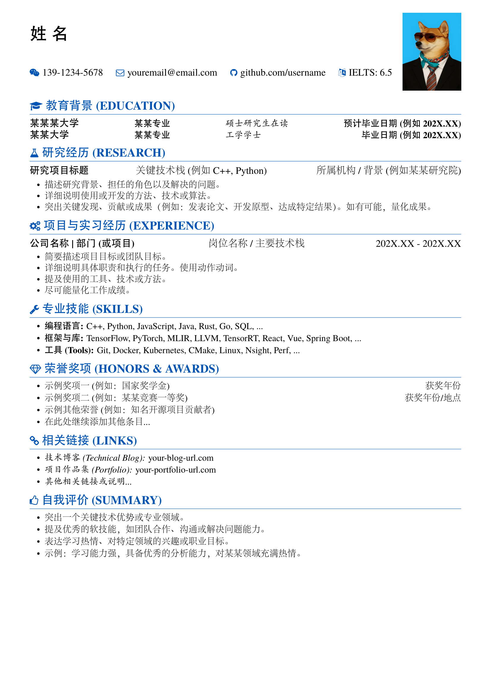
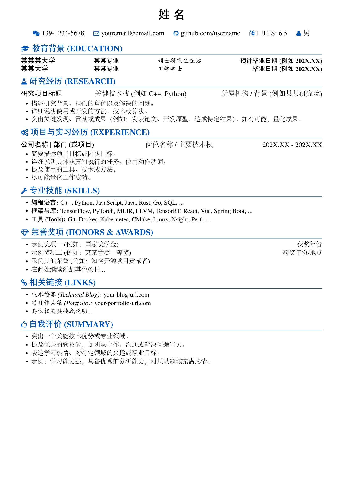
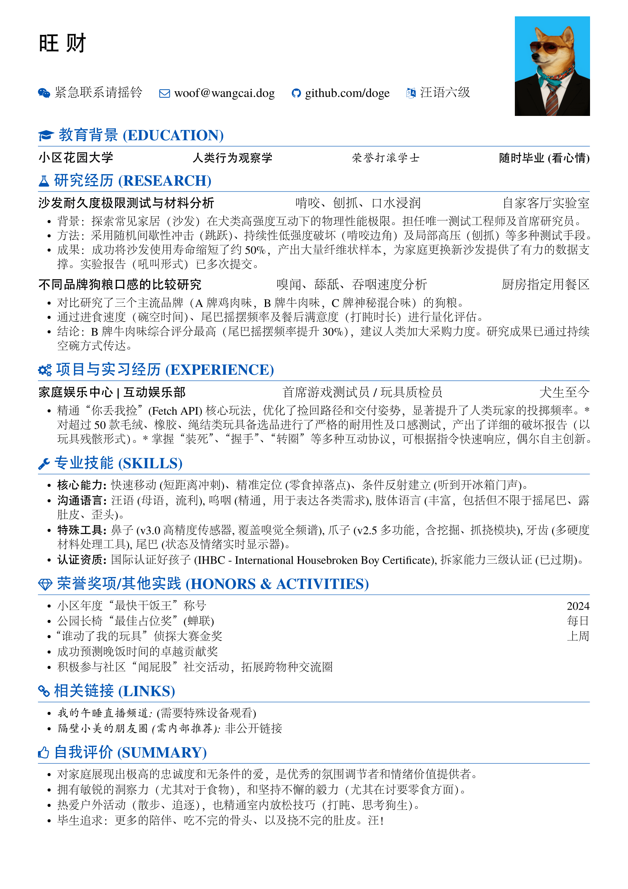

基于 XeLaTeX 的简历模板，支持**照片**和**无照片**两种可选的头部布局  
A XeLaTeX-based resume template, supporting optional header layouts for **photo** and **no-photo** modes

## 效果预览 (Preview)

   
   

   

## 使用

本模板使用 **XeLaTeX** 进行编译。

### 本地环境使用

1.  **获取文件**: 克隆或下载仓库。
2.  **编辑 `.tex` 文件**: 修改 `\name`, `\contactInfo`, `\iconsection` (3参数) 及各分区内容。
3.  **设置照片模式**: 编辑 `.tex` 中的 `\photo` 行（取消注释并指定有效文件名 = 显示证件照片；注释掉/删除 = 隐藏证件照片）。
4.  **编译**: 在终端中运行： `make resume-zh_CN.pdf` 编译简历文件。

### 在 Overleaf 中使用

1.  **导入/上传**: 将项目文件添加到 Overleaf。
2.  **确认编译器**: 检查 **`Menu -> Settings -> Compiler`** 是否为 **`XeLaTeX`** 
3.  **编辑 `.tex` 文件**: 修改内容。
4.  **设置照片模式**: 上传照片文件，并在 `.tex` 中编辑 `\photo` 行（取消注释 = 显示照片；注释掉 = 隐藏照片）。
5.  **编译**: 点击 "**Recompile**"。

---

## 🚀 Usage

This template **must** be compiled using the **XeLaTeX** engine.

### Local

1.  **Get Files**: Clone or download the repository.
2.  **Edit `.tex` file**: Modify `\name`, `\contactInfo`, `\iconsection` (3 arguments), and section content.
3.  **Set Photo Mode**: Edit the `\photo` line in `.tex` (uncomment & set valid filename = show photo; comment out/delete = hide photo).
4.  **Compile**: In your terminal: `make resume-zh_CN.pdf`: Compile the specified file.

### Overleaf

1.  **Import/Upload**: Add project files (`.cls`, `.tex`, fonts, image) to Overleaf.
2.  **Confirm Compiler**: Check that **`Menu -> Settings -> Compiler`** is set to **`XeLaTeX`** (Overleaf usually defaults to this when `fontspec` is detected, but verification is recommended).
3.  **Edit `.tex` file**: Modify content.
4.  **Set Photo Mode**: Upload the photo file, then edit the `\photo` line in `.tex` (uncomment = show; comment out = hide).
5.  **Compile**: Click "**Recompile**".